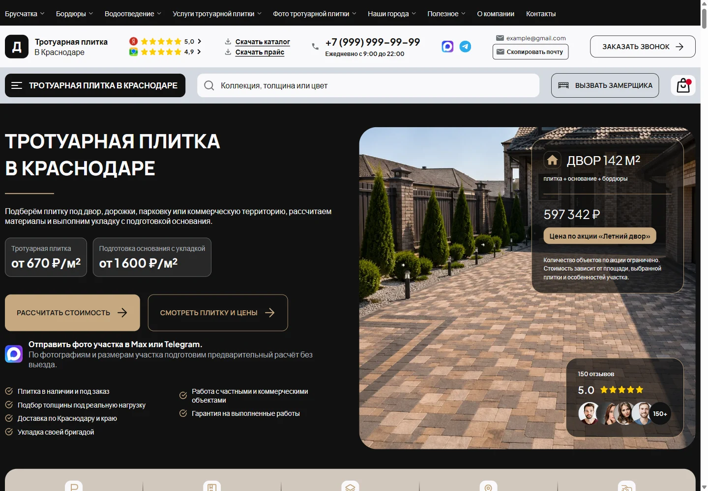
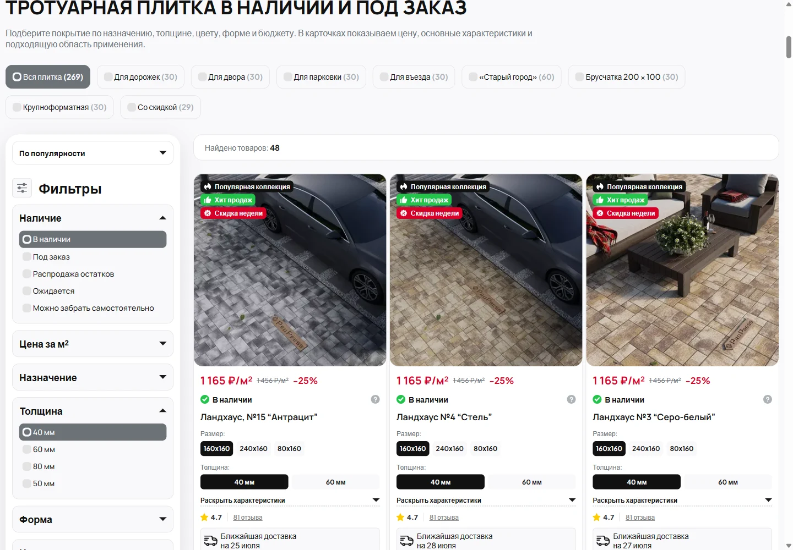

# Paving & Stone — Custom WordPress Theme

A custom WordPress/ACF website for paving services, with reusable content blocks and calculation interfaces.

[Deutsch](README.de.md) · [Developer portfolio](https://portfolio.bogdananisovec.workers.dev/)

## My contribution

I developed the custom theme, ACF content structure, responsive templates and frontend interactions.

## Features

- ACF-managed pages, shared settings and reusable PHP sections.
- Calculation/quiz interfaces and enquiry forms.
- Project galleries, reviews, FAQs and service content.
- Responsive layouts and structured content for technical SEO.

## Stack and structure

WordPress, PHP, ACF Pro, JavaScript, CSS

`acf/` contains field definitions; PHP templates and `inc/` contain rendering logic; frontend assets live alongside the theme.

## Local setup

1. Install WordPress and ACF Pro separately.
2. Install this folder as a theme.
3. Import/sync the JSON field groups in `acf/`.
4. Create demo content, assign page templates and configure menus/global settings.

## Validation

PHP syntax and JSON parsing were checked. A complete populated WordPress installation is not bundled.

## Scope of this public copy

The code demonstrates custom theme and editor architecture. Client content, credentials and the WordPress database are excluded.

This is a standalone portfolio source copy. Production databases, credentials, customer records and local runtime data are excluded. Third-party packages and assets retain their respective rights; their inclusion does not imply authorship.
